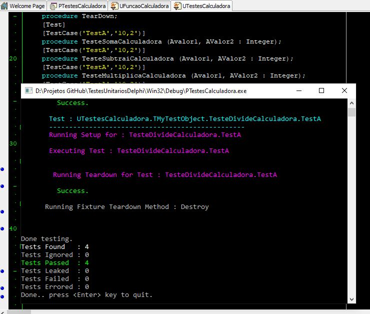

# TestesUnitariosDelphi
Entendendo o funcionamento de testes unitários com Delphi - DUnitX

<li>Para abrir o projeto na IDE sem erros, é necessário a utilização do framework DUNITX no DELPHI XE2. </li>  

